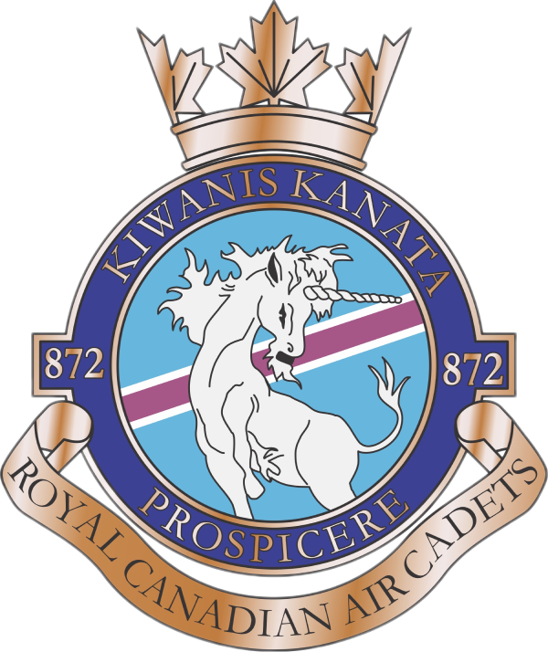



 


LIVE
 

## 🚀 Project Overview

During my final semester at Algonquin College, I found myself part of a team tasked with an exciting challenge: redesigning the website for the 872 Kiwanis-Kanata Royal Canadian Air Cadet Squadron (872 RCACS). Little did I know this project would become a journey of discovery, pushing me to grow not just as a developer, but as a collaborator and problem-solver. 🌱

## Design system

### Colour scheme

 
**Navy Blue (#3C4193)** , our primary color. This color represents professionalism and trust, perfect for our logo and key information.

 
**Sky Blue (#67B6DD)** , used as Secondary color. It's applied to interactive elements like buttons, evoking a sense of clarity and openness.

 
**Dark Navy (#0F172A)** , used for text and some background elements to provide contrast and readability.

### Typography

- **Noto Sans** serves as our primary font, chosen for its clean lines and excellent readability across various screen sizes and devices.
- '**Roboto**' is used for headers, providing a strong visual hierarchy and enhancing the overall design aesthetics with its crisp, modern look.

## 🎭 The Challenge

When we first approached the project, the existing 872 RCACS website was... well, let's just say it had seen better days. 😅 It was a classic case of a website stuck in time, struggling to meet the needs of its users in the modern digital landscape. Our mission was clear: breathe new life into this digital space, making it not just functional, but truly reflective of the dynamic spirit of the Air Cadet program. 💨

## 🏊‍♂️ Diving into the Deep End

As someone who had always been fascinated by the intersection of design and functionality, I was thrilled to dive into the UI/UX aspects of the project. It was like being given a blank canvas and a set of digital paintbrushes - exciting, but also a bit daunting. 🎨

I found myself wearing multiple hats:

- Part detective 🕵️‍♂️, unraveling the mysteries of user behavior and needs
- Part architect 👷‍♂️, restructuring the site's information to create a more intuitive journey
- And sometimes, part diplomat 🤝, balancing the desires of our client with the realities of web design best practices

## 💻 WordPress: My New Best Friend (and Occasional Nemesis)

Our team decided to use WordPress as the foundation for the new site. While I had some experience with WordPress, this project pushed me to explore its depths in ways I never had before. From wrestling with theme customization to optimizing performance, each day brought new challenges and learning opportunities. 🧠

There were moments of frustration, sure. Like the time I spent hours troubleshooting a plugin conflict only to realize the solution was embarrassingly simple. 😅 But with each obstacle overcome, my confidence grew, and so did my appreciation for the platform's versatility.

## 🤝 The Power of Teamwork

One of the most valuable lessons from this project was the importance of collaboration. Our team was a diverse mix of talents and personalities, each bringing something unique to the table. 🌈

I learned the art of clear communication, the value of supporting my peers, and the power of combining different perspectives to create something truly special. It wasn't always smooth sailing - we had our share of disagreements and misunderstandings. But working through these challenges together only made our final product stronger. 💪

## ✨ Moments of Truth

As the project progressed, we had several "aha!" moments that stick with me:

1. The day we presented our first prototype to the 872 RCACS representatives and saw their eyes light up with excitement. 🎉
2. When we successfully implemented accessibility features and realized we were making the site truly inclusive for all users. ♿
3. The moment we ran our final performance tests and saw the dramatic improvement in load times. ⚡

These were the moments that reminded me why I fell in love with web development in the first place - the ability to create something that makes a real difference.

## 🔭 Looking Back, Moving Forward

As I reflect on this project, I'm filled with a sense of pride and gratitude. Pride in what we accomplished as a team, and gratitude for the growth opportunities it provided. 🙏

This experience taught me that web development is so much more than writing code. It's about understanding people, solving real-world problems, and constantly pushing yourself to learn and adapt. 🚀

As I step into the professional world, I carry with me not just new technical skills, but a deeper understanding of what it means to be a developer. I'm excited to see where this journey takes me next, and I'm grateful for the solid foundation this project has provided. 🌟
