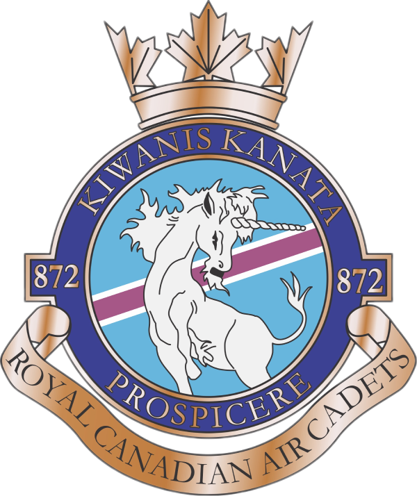



 


LIVE
 

## 🚀 Project Overview

A final-semester team project at Algonquin College to rebuild the website of 872 Kiwanis-Kanata Royal Canadian Air Cadet Squadron. The existing site was outdated and hard to navigate; our mandate was a modern, accessible WordPress rebuild that reflected the program.

## Design system

### Colour scheme

 
**Navy Blue (#3C4193)**, primary. Professionalism and trust; used for the logo and key information.

 
**Sky Blue (#67B6DD)**, secondary. Interactive elements such as buttons — clarity and openness.

 
**Dark Navy (#0F172A)**, text and background accents for contrast and readability.

### Typography

- **Noto Sans** — primary, chosen for clean readability across screen sizes and devices.
- **Roboto** — headers, crisp modern look to reinforce visual hierarchy.

## Role & stack

- **Role**: UI/UX design, WordPress theme customization, information architecture
- **Stack**: WordPress, custom theme, accessibility-first components

## Outcomes

- Information architecture restructured around user tasks, replacing the legacy layout
- Accessibility features implemented so the site is usable by all visitors
- Page load times significantly improved over the legacy site
- Client review: the 872 RCACS representatives approved the first prototype without major revisions
