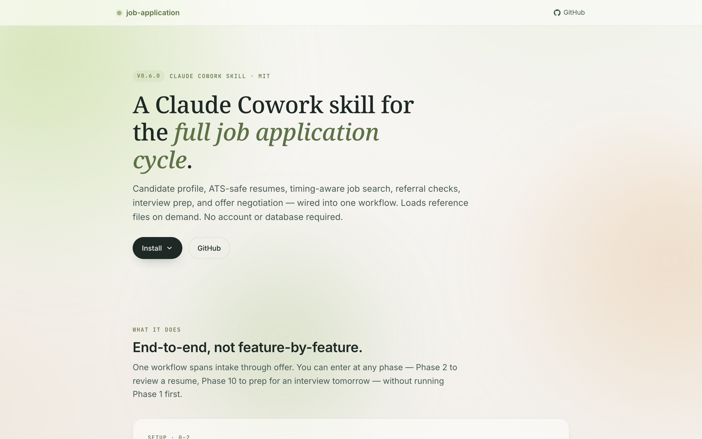
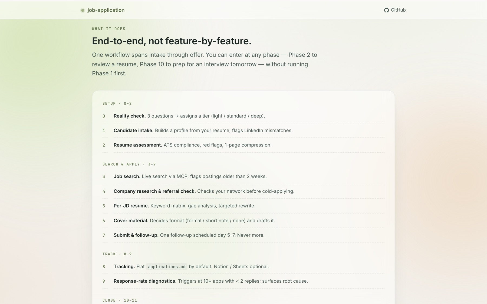
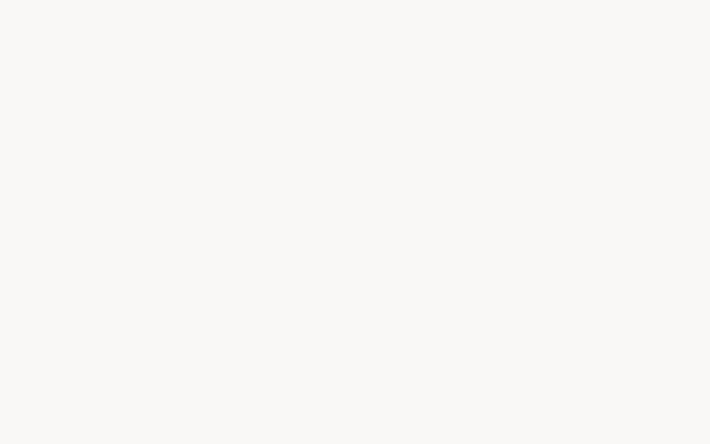




Landing page
 &nbsp;&nbsp;&nbsp; 
GitHub


## Why this exists

I was job-searching and the AI tools I tried all did the same thing: they generated resume bullets. None of them treated the search as a **pipeline** — intake, ATS review, company research, per-JD customisation, referral, submission, follow-up, interview prep, negotiation. So I built one for myself, then shipped it as a Claude Cowork skill anyone can install.

Six weeks, five releases, one MIT license: [github.com/YizhuangLin/job-application](https://github.com/YizhuangLin/job-application).

## Three design calls that made it usable

Most job-search tools fail because they demand setup the user can't afford. These are the three calls where I refused the default and the skill got better every time.

### 1. Lazy SSOT — don't make the user build infrastructure first

Early versions had a "Phase 1: build your candidate profile" gate. Every downstream phase assumed that profile existed. Real users with an interview tomorrow at 5pm did not want to fill in a 12-field template first.

**Fix (v0.4.0)**: the master profile doc is created only on the **first Tier 1 commit** — the first time the user confirms a hard fact (employer, date, metric). Phases 2 / 3 / 5 / 10 / 11 run without it and back-fill inline. The SSOT shows up when it's useful, not as a toll booth.

### 2. Three strictness tiers — match the user, not the "ideal"

The full 11-phase flow is right for someone running a 10+ hour/week active search. It is wrong for someone with 2 hours a week, and it is wrong for someone with a 3-week runway.

**Fix (v0.6.0)**: Phase 0 asks three questions — time, clarity, urgency — and assigns a tier. **Light** skips SSOT, dossiers, and most cover letters. **Standard** is the documented flow. **Deep** adds proactive research and dossier-per-match for career pivots. The user can switch tiers between phases.

The principle: structural overhead scales to capacity. A light-tier application to a well-chosen role outperforms a deep-tier application to a bad one. Tier is not a quality gate.

### 3. Markdown-first tracker — default to the thing that works everywhere

Earlier versions said "Notion / Sheets / Airtable work equally well." Claude read that as "ask the user which one" and the first action in Phase 8 was always a 0→1 onboarding to a third-party connector.

**Fix (v0.5.0)**: the default tracker is `applications.md` in the workspace, edited in place. Notion and Google Sheets are now opt-in adapters, not equal choices. Zero accounts, zero external dependencies, good for ~100 applications. The user who wants Notion can still have Notion — but nobody is forced to sign up to track job apps.

## Emotional layer (the part other tools pretend isn't there)

Separate reference file: `coping.md`. Four situations job-search tools almost always ignore:

- **24-hour rejection protocol** — what to do after a High-Match rejection
- **Burnout signals** — ≥ 15 applications in 7 days + no replies triggers a diagnostic, not a push to apply more
- **Pre-interview stabilization** — 30-minute nervous-system protocol when the interview is ≤ 48h away
- **Offer-fear reality data** — offer withdrawal after acceptance is < 5%, despite what anxiety says

Hooked into Phases 8 / 9 / 10 / 11 so it surfaces when relevant, not as a "wellness module off to the side."

## Engineering decisions that keep it cheap to run

- **Reference Loading Map** — SKILL.md is a router (227 lines, down from 482 in v0.3). Each phase declares which of the 13 reference files it needs. Claude loads only the relevant ones. Token budget per conversation stays predictable.
- **`evals/` directory** — five prompt-level regression scenarios guard against specific failure modes (Phase 2 routing when a resume exists, Phase 10 without prior SSOT, keyword placement without density stuffing, Phase 8 defaulting to markdown not Notion, Phase 0 routing casual users to light tier).
- **No fabrication hard rule** — the skill never adds skills the candidate doesn't have. Gaps are noted in cover letters, never invented into the resume.
- **SemVer + Keep a Changelog** — every release has a dated entry, a "why" line, and migration notes. Five versions from v0.2.0 to v0.6.0 are all documented.

## The landing page — [cestduleon.dev/job-application/](https://cestduleon.dev/job-application/)

A one-page site I wrote from scratch in a single HTML file. No framework, no build step, no CMS.

### Design system

 
**Paper (#F7F4EC)** — primary background. Warm off-white that reads as a document, not a dashboard.

 
**Moss deep (#6B8456)** — accent. Used sparingly for primary CTAs, pill outlines, and copy-confirm badges. The hue is a deliberate move away from SaaS-blue.

 
**Cream (#E6D4B0)** — soft emphasis for kickers and version pills.

### Typography

- **Noto Serif** (display) — for H1 / H2. The serif signals this is an editorial landing, not a product landing
- **Inter** (body) — for lead copy and UI
- **JetBrains Mono** (trigger phrases) — because "say one of these in a Cowork chat" is a command-line gesture, not a marketing button

### What the page does beyond the obvious

- **Click-to-copy trigger phrases**. The CTAs are not "Sign up" — they're the actual words you say in Claude Cowork to launch the skill. Click a trigger, the phrase is on your clipboard, paste into Cowork, go.
- **Tabbed install block**. Two paths (download `.skill` bundle vs clone from GitHub) switchable without page reload. A 3-line JS handler, no React.
- **`prefers-reduced-motion` respected**. Three animated background blobs freeze; scroll-reveals become instant.
- **Skip-to-content link + sr-only live region for clipboard feedback**. Keyboard and screen-reader users get full parity.
- **Total weight**: ~28 KB of HTML + CSS + inline JS before fonts. Fonts load async from Google Fonts.

## Release cadence

| Version | Date | What changed |
|---|---|---|
| v0.3.0 | Mar 2026 | 9 → 11 phases; added referral / interview-prep / salary-negotiation references |
| v0.4.0 | Apr 2026 | Architecture refactor — SKILL.md 482 → 227 lines, Reference Loading Map, `evals/`, three-tier document sync |
| v0.5.0 | Apr 17 | Tracker default → flat markdown; Notion / Sheets demoted to opt-in adapters |
| v0.6.0 | Apr 17 | Phase 0 reality check + three strictness tiers; `coping.md`; Lazy SSOT propagated to every phase |

Every version shipped because a real usage scenario broke. I fixed the scenario, added a regression eval, tagged the release.

## Stack

- **Skill** — Markdown + YAML frontmatter, reference lazy-loading, Claude Cowork runtime, Python helpers for `.docx` / PDF
- **Landing page** — single HTML file, vanilla CSS (custom properties, glassmorphism), vanilla JS (IntersectionObserver, Clipboard API, GSAP for background motion only), Google Fonts
- **Distribution** — GitHub Releases (`.skill` bundle), MIT license, SemVer tags, Keep-a-Changelog

## What I'd tell a hiring manager reading this

I ship. I iterate on evidence — every version above responded to a specific user scenario that broke. I design for the user's actual capacity, not the product team's ideal user. I know when to use a framework and when not to (landing page: no framework). And I understand that the interface for an AI product is often *language*, not buttons — hence the click-to-copy trigger phrases, not a signup form.
