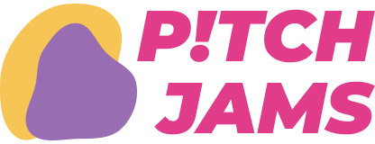



## Background

This is the result of a hackathon, where three other 3 team members and I built a demo of an “idea sharing and crowdfunding platform” from 0 to 1 using Figma.**Got 1st prize with $1000 award.**

## Summary

Pit Jams is **a website for ideaters to upload video pitches and share with community/audience, especially future investors.** mainly targeting students and other young people, by providing a platform to share ideas, so that more creative ideas have the possibility of being realized.
>A team of 4 people to complete product design with `mind-notes`, `wireframes`, `Figma`, `UML`, and `ERD`. 

### Preview interface

<iframe style="border: 1px solid rgba(0, 0, 0, 0.1);" width="655" height="450" src="https://www.figma.com/embed?embed_host=share&url=https%3A%2F%2Fwww.figma.com%2Fproto%2FiPlSWlebbBTFRwGwHxY2TD%2FPitch-Jams%3Fpage-id%3D0%253A1%26type%3Ddesign%26node-id%3D15-5%26viewport%3D1315%252C403%252C0.52%26t%3DLiU5QGsT31KA96oj-1%26scaling%3Dscale-down-width%26starting-point-node-id%3D15%253A5%26mode%3Ddesign" allowfullscreen></iframe>

**Click anywhere** in the preview window to interact with it. **Click  `<` `>`** at the bottom to see all pages, **Click the top right corner button** to see it full screen.


## Structure
Designed product structure and functions based on customer demand analysis, with a website map of 8 web pages. 
- Core function including homepage browsing, 
- event organizing, searching, posting, joining team
- showcase
- pitch managing
- user profile managing

## Design system
We have developed a series of website plans that target a younger user base and are in line with the brand name.

### Colour scheme
 
**Primary: Goldenrod( #F6C555)** 
Goldenrod is a medium shade of gold-yellow that's both striking and gentle. As the primary background color for this project, it enhances the design's vibrancy, harmonizes well with other colors, and complements user-uploaded materials.

 
**Secondary: Vibrant Pink(#E03C8A)** 
Vibrant Pink is a lively, bright shade of pink that exudes energy. It's especially suited for younger audiences, capturing attention as an accent color and pairing well with softer tones for a relaxed visual experience.

 
**Tertiary: Soft Purple(#986DB2)** 
Soft Purple is a refined and elegant shade of purple with a subtle gray undertone. It brings a sense of tranquility to a website and pairs seamlessly as a delicate accent with other hues.

To maintain clarity, the background is pure white.  

### Typography

- **Noto Sans** is the primary choice for many designers due to its lively and contemporary feel, making content approachable "
-  '**Roboto**' for headers, this font brings a modern touch, ensuring that titles stand out with a relaxed yet fitting elegance."

## Something special
Created multiple user interactions with impressive and unique UX/UI to serve for 4 essential aspect of monetization: 
- community events
- crowdfunding
- team building
- storytelling

---

Group assignment by 
- <u>[Celia]( https://www.linkedin.com/in/xiaoyi-tang-670a22228/)</u> 
- <u>[Iris](https://github.com/Iriswang0916)</u> 
- <u>[Jerome](https://hitori.rocks/)</u>
- <u>[Leon(author)](https://cestduleon.dev)</u> 