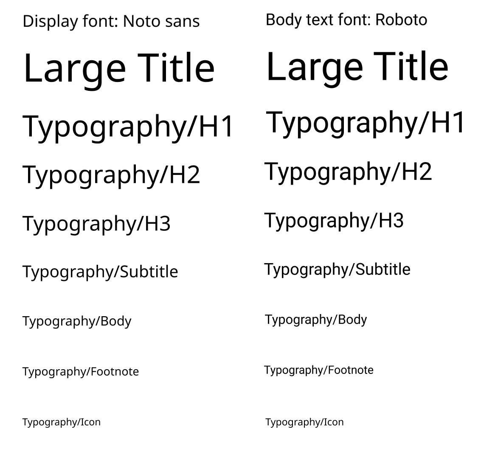

## Summarize

Foodie is a takeaway app with a more dynamic design. Not only does it have a wide variety of food choices like other takeaway sites, but more importantly, it gives you suggestions on what you want to eat from the wide selection.

And here's what we're trying to accomplish: **Foodie makes your food ordering process enjoyable.** Don't know what to eat? Come and get a hint from our community-curated recommendations and food matches!

<iframe style="border: 1px solid rgba(0, 0, 0, 0.1);" width="700" height="450" src="https://www.figma.com/embed?embed_host=share&url=https%3A%2F%2Fwww.figma.com%2Fproto%2F8XLT012kk3b72NmlQ7FMc7%2FFoodie!%3Fpage-id%3D149%253A15%26type%3Ddesign%26node-id%3D194-447%26viewport%3D375%252C400%252C0.08%26t%3DfdFgOTvAlIr1WHm3-1%26scaling%3Dscale-down-width%26starting-point-node-id%3D194%253A447%26show-proto-sidebar%3D1%26mode%3Ddesign" allowfullscreen></iframe>

## What did we do?

### Design system

#### Colour scheme



- **Mustard Yellow( #F2BE22)**, our primary color. This attracts attention, especially to our logo and key information. 

- **Deep Green(#22A699)**, used as Secondary color. It's used for regular buttons, suggesting nature and tranquility.

- To maintain clarity, the background is pure white.  

#### Typography

- **Noto Sans** is the primary choice for many designers due to its lively and contemporary feel, making content approachable "
-  '**Roboto**' for headers, this font brings a modern touch, ensuring that titles stand out with a relaxed yet fitting elegance."

#### Button/Card/Tab

<iframe style="border: 1px solid rgba(0, 0, 0, 0.1);" width="700" height="450" src="https://www.figma.com/embed?embed_host=share&url=https%3A%2F%2Fwww.figma.com%2Fproto%2FAXNTbxVFslLCRh1TjeZtL4%2FPart-2%253A-Design-System%3Fpage-id%3D106%253A55%26type%3Ddesign%26node-id%3D118-62%26viewport%3D448%252C293%252C0.59%26t%3DL7t1u9efnDpQgLeJ-1%26scaling%3Dscale-down-width%26mode%3Ddesign" allowfullscreen></iframe>

Using rounded edges on buttons and cards, along with matching color themes, makes things look neat and user-friendly.

---

Group assignment by <u>[Jerome](https://hitori.rocks/)</u>, Thomas and me.

