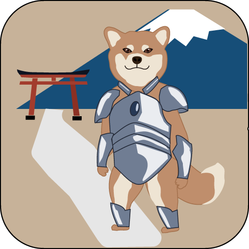
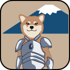



Who am i?



## Profile

| Address  |Ottawa, Canda                         |
| -------- | ------------------------------------------------------------ |
| Tel      | 343-596-6688                                                 |
| E-mail   | [leon_lin@cestduleon.dev](mailto:leon_lin@cestduleon.dev)    |
| Linkedin | [www.linkedin.com/in/yizhuang-lin-299253278](http://www.linkedin.com/in/yizhuang-lin-299253278) |
| Github   | https://github.com/YizhuangLin                               |
| Website  | [https://cestduleon.dev](https://cestduleon.dev/)            |

## Skills

- UI Design: **Figma**, **Illustrator**, **Photoshop**
- Front-end: `HTML`, `CSS`, `JavaScript`, `React`,`` .NET (C#)``, `PHP`, `Hugo`, `bootstrap`
- Back-end: `Git`, `GitHub`,`Python`, `MySQL`, `Linux Deployment`, `Docker`
- **Team-based project implementation**
- Office Skills: Microsoft Office Suite (Word, PowerPoint, and Excel)

## Portfolio
**Click here to view my portfolio:**


Portfolio


## Education

### Algonquin College ###
  **Web Development & Internet Applications** 
  **Ottawa, Canada**🇨🇦 
  2023 - Now    

### Shanghai Lida University ###
  **Exhibition Planning and Management** 
  **Shanghai, China**🇨🇳 
  2013 - 2017    

## Life Map





2023.01 - Now 





2021.11 - 2022.11





2020.11 - 2021.11





2018.06 - 2020.11





2016.11 - 2018.03





2013.09 - 2017.07





 

<!-- #### [Foodie](https://www.figma.com/file/8XLT012kk3b72NmlQ7FMc7/Foodie!?type=design&node-id=243%3A499&mode=design&t=3Z8MUCBdiLmP4kay-1)     08/2023

`Algonquin College`

This is a takeaway website design demo built with **Figma**, which is also a final assignment. Through the three stages of specialized process of Wireframes, Visual Design, and Interactive Visual Protot, we successfully realized our takeaway website design vision.

#### [pitch jams](https://www.figma.com/file/8mCtOuMuFG8mh82IaZElK2/Pitch-Jams?type=design&node-id=0%3A1&mode=design&t=pXRyjQa4oyH910tc-1)     06/2023

`Algonquin College`

This is the result of a hackathon, where three other 3 team members and I built a demo of an "idea sharing and crowdfunding platform" from 0 to 1 using **Figma**.

- Built and led team of 4 people to complete product design with mind-notes, wireframes, Figma, UML, and ERD. The product is a website for ideaters to upload video pitches and share with community/audience, especially future investors.

- Designed product structure and functions based on customer demand analysis, with a website map of 8 web pages. Core function including homepage browsing, event organizing, searching, posting, joining team, showcase, pitch managing, and user profile managing.

- Created multiple user interactions with impressive and unique UX/UI to serve for 4 essential aspect of monetization: community events, crowdfunding, team building, storytelling.

- Presented product pitch within 10 minutes with professional language and fun engaging style, and got 1st prize with $1000 award.

  

#### Shiba Inu Samurai     05/2023

This is a set of **illustrator** logos for ios apps, including iTunes, iPad, and iPhone.


  
  
  


#### [Flow Mastery(Figma Design Preview)](https://www.figma.com/file/uik2hAOX8okeGLnXrF62zj/FlowMastery?type=design&node-id=0%3A1&mode=design&t=pGpbO9NW0ra1nEdW-1)     03/2023

[Final-launch version](https://flowmastery.netlify.app/)

This is a learning tool website built with **HMTL, CSS, and JavaScript**, the main body of the website is a timer based on the tomato method, with a login function, calculator, notepad, and to-do list function.

I was responsible for creating the entire website's design utilizing Figma including the logo, design style and page layout, and all other visual elements.  Although the layout was not fully realized due to time constraints, it was still a great team effort.

#### [Tateyama Kendo Club]([https://tateyama-kendo-club.netlify.app](https://tateyama-kendo-club.netlify.app/))    02/2023

This is a beginner static presentation website made in **HTML and CSS**, a non-official website of a Kendo club.

 -->

## Who am I?

- ~~24601~~

- Focus on code readability/coupling
- Passion for technology and code
- Familiar with teamwork
- React, Mysql, typescript enthusiasts.
- Kendo 1Dun, Still in love with it.